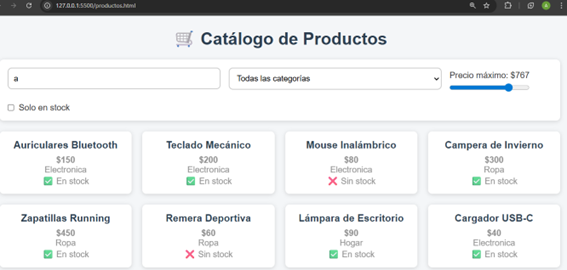
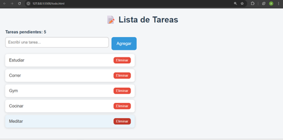
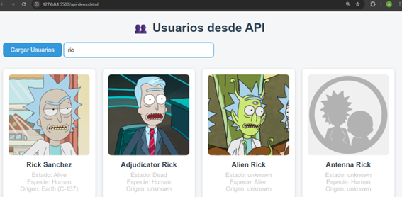

# TP4 — JavaScript ES6+: DOM, Eventos y APIs

**Materia:** Prácticas Profesionalizantes II — Programador Junior  
**Alumno:** Albaro Rodó 

---

## Descripción del proyecto

Mini-aplicación web interactiva desarrollada con JavaScript ES6+ que consume una API pública, manipula el DOM y responde a eventos del usuario.

---

## Páginas del proyecto

### 📄 productos.html
Sistema de filtrado interactivo de productos. Permite filtrar por categoría, precio máximo, stock y búsqueda por nombre. Todos los filtros funcionan combinados y en tiempo real.

### 📄 todo.html
Lista de tareas interactiva. Permite agregar, completar y eliminar tareas. Incluye contador de tareas pendientes y validación para no agregar tareas vacías.

### 📄 api-demo.html
Consume la API pública de Rick and Morty. Muestra personajes como tarjetas con imagen, nombre, estado y especie. Incluye buscador dinámico que filtra por nombre.

---

## Tecnologías usadas

- HTML5
- CSS3 (Variables CSS, Grid, Flexbox)
- JavaScript ES6+ (let/const, Arrow Functions, map/filter/reduce/find)
- Fetch API + async/await
- API pública: [Rick and Morty API](https://rickandmortyapi.com/)

---

## Capturas de pantalla

### Productos

### To-Do App

### API Demo

---

## Instrucciones de uso

1. Clonar el repositorio:

https://github.com/albarorodo1234-oss/tp4-javascript.git 
